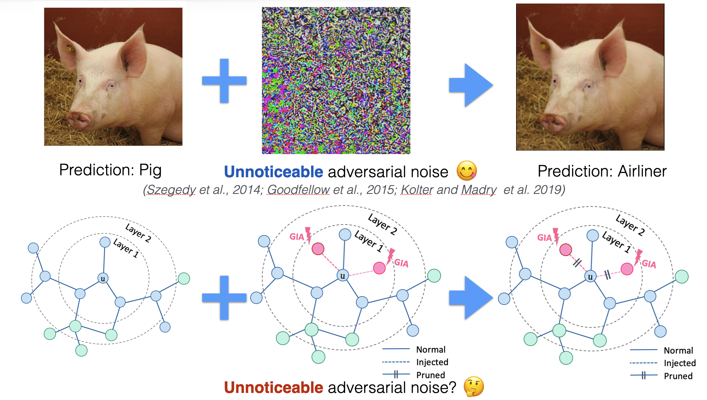

<h1 align="center">GIA-HAO: Graph Injection Attack with Harmonious Adversarial Objective</h1>
<p align="center">
    <a href="https://arxiv.org/abs/2202.08057"></a>
    <a href="https://github.com/LFhase/GIA-HAO"></a>
    <!-- <a href="https://colab.research.google.com/drive/1t0_4BxEJ0XncyYvn_VyEQhxwNMvtSUNx?usp=sharing"></a> -->
    <a href="https://openreview.net/forum?id=wkMG8cdvh7-">  </a>
    <a href="https://github.com/LFhase/GIA-HAO/blob/main/LICENSE">  </a>
    <a href="https://iclr.cc/virtual/2022/poster/6046"> </a>
    <a href="https://lfhase.win/files/slides/GIA-HAO_short.pdf"> </a>
    <!-- <a href="https://github.com/LFhase/GIA-HAO/blob/master/files/poster.png"> </a> -->
</p>

<!-- # GIA-HAO: Understanding and Improving Graph Injection Attack by Promoting Unnoticeability -->
>>
This repo contains the sample code for reproducing results of ICLR'22 Paper *[Understanding and Improving Graph Injection Attack by Promoting Unnoticeability](https://openreview.net/forum?id=wkMG8cdvh7-)*.

<!-- Full code and instructions will be released soon. -->
<!--  -->

Updates:

- July 23, 2022: We shared GIA-HAO in AI Time PhD Workshop for ICLR'22 (in Chinese)! The video link is [here](https://www.bilibili.com/video/BV1BW4y1672F?t=3251). 😆


## Introduction

Graph Injection Attack (GIA) recently emerges as a practical attack scenario. To understand it more, we conduct a friendly comparison between GIA and Graph Modification Attack (GMA) -- Another attack scenario widly studied in early works. We found that:

- Although GIA can be provably more harmful than GMA under certain assumptions, the severe damage to the homophily makes it **<ins>easily defendable</ins>** by homophily defenders (even implemented in a very simple way), which would bring unreliable evaluation about GNNs' robustness.
- Hence we introduced **<ins>homophily unnoticeability</ins>** for GIA to constrain the damage and proposed Harmonious Adversarial Objective (HAO) to mitigate this issue.
  
If you are interested, find out more in our [paper](https://arxiv.org/pdf/2202.08057.pdf), [slides](https://lfhase.win/files/slides/GIA-HAO_short.pdf), or our [poster](files/poster.png)!

<p align="center"></p>
<p align="center"><em>Figure 1.</em> Illustration of GIA-HAO.</p>
<!--  -->

## Use HAO in Your Code
### A implementation skeleton
Essentially, HAO can be implemented very conveniently, in *3* steps!

```python
# step 1: propagate one step (including the injected nodes) without self-connection
#         then we obtain the aggregated neighbor features
with torch.no_grad():
    features_propagate = gcn_norm(adj_attack, add_self_loops=False) @ features_concat
    features_propagate = features_propagate[n_total:]
# step 2: calculate the node-centric homophily (here we implement it with cosine similarity)
homophily = F.cosine_similarity(features_attack, features_propagate)
# step 3: add homophily to your original L_atk with a proper weight, then you make it!
pred_loss += disguise_coe*homophily.mean()
```

Note that it is only a minimal implementation example, you can also implement HAO with different homophily measures tailored for your own case : )

In experiments, we comprehensively examine the effectiveness of HAO with different combinations of various GIA methods, against *38* defense models on *6* benchmarks, under both non-target attack and targeted attack settings. To handle the extensive experiments, we implement both single test and batch test modes.

### Homophily distribution analysis
We provide a [example](./analysis/analyze_homophily.ipynb) in jupyter notebook on homophily distribution analysis. 
You may use it analyze the homophily distribution changes based on the generated perturbed graphs from our code.

## Instructions

### Before Start
The key libraries used in our experiments are:

```
grb==0.1.0
torch==1.9.0
torch-geometric==1.7.2
scipy==1.6.2
```
More information about the dependencies can be found in this [issue](https://github.com/LFhase/GIA-HAO/issues/1#issuecomment-1313171725).

By default, all of the datasets can be loaded automatically, and be careful about the path settings in `load_graph.py`.
All of the generated perturbed graph will be saved to `/atkg` and make sure the folder is valid.
The perturbed graph will be named as `dataset_attack.pt` for non-targeted attack, and `dataset_attack_target.pt` for targeted attack.
We use `--disguise_coe` to control the strength of HAO.

### Single attack tests

In a single attack test, by specifying an attack method, you can generate the perturbed graph and evaluate the robustness of GNNs based on it. Take `grb-cora` as an example:

a. Generating perturbed graphs:

```bash
# Generating Perturbed Graph with PGD
python gnn_misg.py --dataset 'grb-cora'  --inductive --eval_robo --eval_attack 'gia' --grb_mode 'full' --num_layers 3 --runs 1 --disguise_coe 0

# Generating Perturbed Graph with PGD+HAO
python gnn_misg.py --dataset 'grb-cora'  --inductive --eval_robo --eval_attack 'gia' --grb_mode 'full' --num_layers 3 --runs 1 --disguise_coe 1
```

b. Evaluating blackbox test robustness:

```bash
# Evaluating blackbox test robustness with GCN
python gnn_misg.py --dataset 'grb-cora'  --inductive --eval_robo --eval_attack 'gia' --grb_mode 'full' --num_layers 3 --runs 1 --eval_robo_blk

# Evaluating blackbox test robustness with EGuard
python gnn_misg.py --dataset 'grb-cora'  --inductive --eval_robo --eval_attack 'gia' --grb_mode 'full' --model 'egnnguard' --num_layers 3 --eval_robo_blk --runs 1
```

c. Evaluating with targeted attack:
Simply add `--eval_target` to the running commands will do the job.

By changing the parameters according to our paper, you can simply reproduce results for other benchmarks, or test with your own GNNs and benchmarks!

### Batch attack tests

Moreover, you can also evaluate the robustness of different defense models against different attack methods in batch. Here we use `--batch_eval` command in `gnn_misg.py` to enable batch evaluations.
During each evaluation of GNN model, you can use `batch_attacks` and `report_batch` to specify the attacks that you want to evaluate and report. Take `grb-cora` as an example:

```bash
mkdir atkg
bash run_cora.sh
```

The other running scripts are given in `/scripts` folder.

## Misc

Since our focus is to verify the issues surrounding the homophily unnoticeability,
we didn't do exhaustive hyperparameter tuning with the injection strategies.
We believe there are more interesting stuffs to navigate about these strategies,
where we list a few in Appendix A of our paper.
Welcome to check it out and play with our code base!

If you have any questions, please feel free to send me (Andrew) an
email via: yqchen [at] cse (dot) cuhk (dot) edu (dot) hk.
If you find our paper and repo useful, please cite our paper:

```bibtex
@inproceedings{chen2022hao,
    title={Understanding and Improving Graph Injection Attack by Promoting Unnoticeability},
    author={Yongqiang Chen and Han Yang and Yonggang Zhang and Kaili Ma and Tongliang Liu and Bo Han and James Cheng},
    booktitle={International Conference on Learning Representations},
    year={2022},
    url={https://openreview.net/forum?id=wkMG8cdvh7-}
}
```

Ack: The readme is inspired by [GSAT](https://github.com/Graph-COM/GSAT) 😄.
